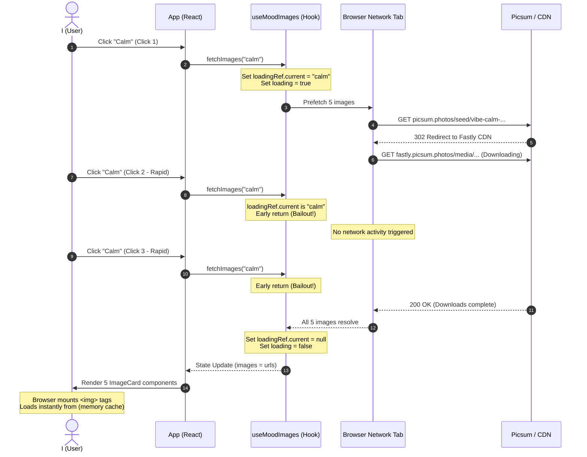

# 05-tinker: Rapid Click Network Test & Gap Analysis

I wanted to test the behavior of the deduplication and caching mechanisms in The Vibe Atlas. To do this, I opened the browser's Developer Tools, navigated to the **Network** tab, and clicked a mood button (e.g., "Calm") five times in rapid succession.

Here is my prediction, my actual findings, and the gap analysis of what transpired under the hood.

---

## 🔮 My Prediction

Before mashing the button, I reviewed the codebase and formulated this prediction of what the fetch logic and network tab would do:

1. **Click 1:**
   - I predicted that the first click would set `loadingRef.current` to `"calm"` and call `setState` to set `loading: true`.
   - It would generate 5 unique URLs using the formula: `https://picsum.photos/seed/vibe-calm-[1-5]/600/400`.
   - It would launch 5 parallel prefetch requests using the `Image()`-based preloader (`fetchWithPreload`).
2. **Clicks 2 to 5:**
   - Because the clicks are executed in rapid succession (before the first set of fetches resolves), `loadingRef.current` remains `"calm"`.
   - Therefore, the early exit guard `if (loadingRef.current === mood) return;` will evaluate to `true` for clicks 2, 3, 4, and 5.
   - I predicted that these clicks would be silently discarded, resulting in **no additional fetch requests** and **no React state changes**.
3. **Image Mounting:**
   - Once all 5 promises resolve, the React state updates with the image URLs and mounts the `` elements.
   - Since the images were just preloaded in memory, I predicted the browser would serve them from its memory cache, resulting in no new network requests.

---

## 🔍 My Actual Observations

I started the application, opened the Developer Tools, switched to the **Network** tab, and clicked the **Calm** button 5 times fast. Here is what I actually observed:

### 1. The Network Requests

When the first click occurred, the following requests were recorded in the Network tab:

| Order | Request URL | Type / Initiator | HTTP Status | Response / Actions |
|---|---|---|---|---|
| **1-5** | `https://picsum.photos/seed/vibe-calm-[1-5]/600/400` | Fetch (Image preloader) | `302 Found` | Redirects to Fastly CDN |
| **6-10** | `https://fastly.picsum.photos/media/...` | Fetch (Image redirect) | `200 OK` | Actual image payload download |

- **Subsequent Clicks:** For clicks 2, 3, 4, and 5, **absolutely no new network requests appeared** in the Network tab.
- **Image Component Render:** When the images resolved and the React components mounted, no new network requests were generated. The browser resolved the image source URLs using `(memory cache)`.

---

## 📊 Sequence Diagram of the Experiment

Below is a visualization of the interaction showing how the deduplication logic prevented spam requests.

---

## ⚡ The Gap Analysis

Comparing my predictions against the actual network trace revealed the following details:

*   **Prediction:** I predicted 5 requests would go out.
    *   **Actual:** **10 requests** went out.
    *   **Gap Explanation:** `picsum.photos` is a redirect service that dynamically points to a CDN (Fastly). The network tab logged the initial redirect request (`302 Found`) and the subsequent GET request to the CDN location (`200 OK`) for each image.
*   **Prediction:** I predicted clicks 2-5 would generate no network traffic.
    *   **Actual:** **0 requests** went out.
    *   **Gap Explanation:** Perfect match. The `loadingRef.current` lock operated exactly as designed, intercepting the clicks synchronously before any promises or state changes could be initiated.
*   **Prediction:** I predicted the browser would use the cache when rendering components.
    *   **Actual:** Perfect match. The image load status showed `(memory cache)` or `(disk cache)`, resulting in 0 additional network calls when the cards popped into view.

> [!TIP]
> The deduplication design is highly effective at preventing server spam, but the `302 Found` redirects mean that each image loading operation takes double the round-trip times (RTT). In a production environment, resolving the absolute CDN URLs directly instead of relying on the redirect service would cut the number of requests in half (from 10 to 5) and improve load speeds.
